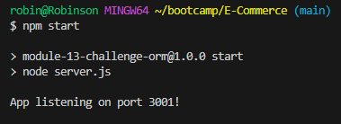
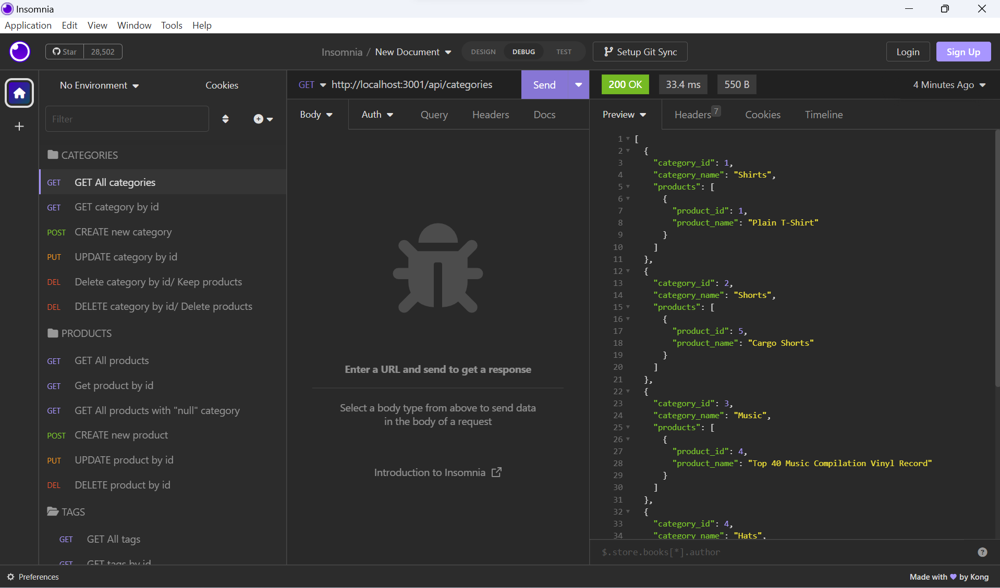

# E-Commerce  

  ## Description

  This project was developed as a tool to manage an E-commerce store, where through the applications' functionalities the end user is able to organize the products in addition to separating them by categories, create tags to define their specifications and add, update or delete them according to the state of the stock.

  ## Table of Contents
  - [Installation](#installation)
  - [Usage](#usage)
  - [License](#license)
  - [Contributing](#contributing)
  - [Credits](#credits)
  - [Questions](#questions)
  
  ## Installation

  Navigate to https://github.com/robinsonfdossantos/E-Commerce.

  Open a local built-in Terminal (powershell, bash) on your local machine.

  Navigate to a desired folder to place your project in, using 'cd "folder"'.

  Use 'git clone' to copy the repository to your local computer by typing "git clone git@github.com:robinsonfdossantos/E-Commerce.git".
  
  ## Usage

  Run the terminal built into VS Code. Make sure you have installed all required packages using 'npm install or npm i'.

  Before running the program make sure you run the database by typing 'mysql -u root -p' and after entering your password type 'source schema.sql;' to create the database or load it again. Make sure you have navigated to the right path in the terminal to run the database, for example './E-Coomerce/db'.

  Once the database has been created, return to the main terminal of the application and run the command 'npm run seed' in order to populate the database with the initial data that will be used to test the application. Then, a list of information will come to your terminal to inform you that the database has been populated.

  Now it is time to run the application by 'npm start' command. The following image represents an example of the message that should arrive at your terminal to inform you that the application has started correctly.

  

  When you have successfully launched the application it is time to start managing it from the back end using a debugging tool, in this example I will be using Insomnia.

  Through Insomnia you will be able to execute the creation routes created in the application and get the results in JSON data.

  The illustration below shows an example of how Insomnia should present information when a route is requested.

  

  As you can see, the JSON data is presented on the right side.

  The following link is related to a video of the application in operation, watching it you will be able to go through the options provided by the application, get some examples of how to update the elements and also follow the steps to start the application if you still have doubts.

  https://drive.google.com/file/d/1gRp1m0SeDooTw1YAS4hrIwSyUmDXikU0/view

  
  ## License

  This application is covered under the MIT license.
  
  ## Contributing

  All users are very welcome to leave their comments and suggestions for improvement by sending me a direct message or creating pull requests on Github.
  
  ## Credits

  MySql

  Insomnia

  Boot camp members who provided the structure codes.
    

  ## Questions
  
  For any questions or inquiries, please reach out to me via [GitHub](https://github.com/robinsonfdossantos) or email me at robinsonfdossantos@gmail.com.
    

 